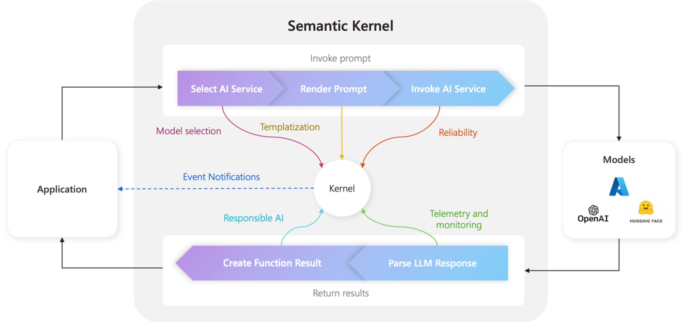

# Semantic Kernel Java Demo



## Introduction
This project is a Java application that interacts with a set of lights using a Semantic Kernel OpenAI plugin system.

## Installation
### Prerequisites
- Java Development Kit (JDK)
- Maven
- Set the `OPENAI_API_KEY` environment variable

### Steps
1. Clone the repository:
    ```sh
    git clone https://github.com/roryp/aistack.git
    cd aistack
    ```

2. Set the `OPENAI_API_KEY` environment variable:
    ```sh
    set OPENAI_API_KEY=your_key_value
    ```

3. Build the project:
    ```sh
    mvn clean install
    ```

## Usage
### Running the Application
To run the application, use the following command:
```sh
java -cp target/classes com.example.semantic.App
```

## Learn More
For more information, visit the [Semantic Kernel Documentation](https://learn.microsoft.com/en-us/semantic-kernel/get-started/quick-start-guide?pivots=programming-language-java).

## Appendix - detailed design

## Import Statements:

The code begins by importing various classes and packages required for the application, including Azure OpenAI, Semantic Kernel, and other utility classes.


## Constants Initialization:

Two constants are defined: `OPENAI_API_KEY` (retrieved from environment variables) and `MODEL_ID` (set to "gpt-4").

## OpenAI Client Setup:

An `OpenAIAsyncClient` is created using the `OpenAIClientBuilder` with the provided API key.

## Chat Completion Service Setup:

A `ChatCompletionService` is created using the `OpenAIChatCompletion` builder, configured with the model ID and the OpenAI client.

## Plugin Creation:

A `KernelPlugin` named `lightPlugin` is created from an instance of `LightsPlugin` using the `KernelPluginFactory`.

## Kernel Setup:

A `Kernel` is built using the `Kernel.Builder`, which includes the `ChatCompletionService` and the `lightPlugin`. The kernel is then built and stored in a variable.

## Hook and Invocation Context Setup:

A `KernelHooks` instance is created, and a pre-tool call hook is added to print the function name before any tool call.
The hook is added to the global kernel hooks.
An `InvocationContext` is created with specific return mode and tool call behavior settings.

## Chat Interaction Loop:

A `ChatHistory` instance is created to store the conversation.
A loop is initiated to handle user input and generate responses using the chat completion service.
User input is read from the console, added to the chat history, and processed by the chat completion service.
The results are printed, and the assistant's messages are added to the chat history.
The loop continues until the user provides an empty input.


